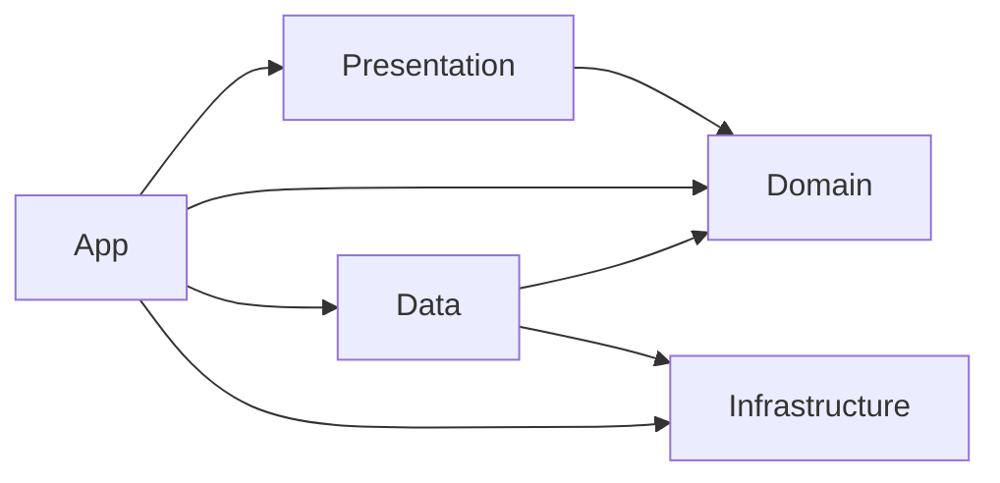

# yeobaek UIKit 아키텍처

> 이 문서는 **Clean Architecture의 의존성 분리와 UIKit의 MVVM을 조합한 출발 설계**예요. 생성 명령은 프로젝트 코드를 분석하지 않아요. 아래 경로, 계층, 라이브러리가 현재 프로젝트에 이미 존재한다고 뜻하지 않아요. 적용하지 않는 규칙은 지우고 실제 구조를 기록해요.

## 목차

- [아키텍처 개요](#아키텍처-개요)
- [계층별 구조](#계층별-구조)
- [의존성 방향과 데이터 흐름](#의존성-방향과-데이터-흐름)
- [주요 패턴과 사용 기술](#주요-패턴과-사용-기술)
- [새 기능 개발 체크리스트](#새-기능-개발-체크리스트)
- [관련 문서](#관련-문서)

## 아키텍처 개요

### 구조와 책임

기능을 추가할 때 화면 코드는 데이터를 어디서 가져오는지 몰라도 되고, 비즈니스 규칙은 UIKit이나 저장소 기술을 몰라도 되도록 나눠요. 다음은 디렉터리 구성 **예시**예요. 실제 프로젝트의 타깃·폴더 이름으로 바꿔요.

```text
Sources/
├── App/                 앱 시작점, 화면 흐름, 의존성 조립
├── Presentation/        화면, ViewController, ViewModel
├── Domain/              Entity, UseCase, Repository 계약
├── Data/                Repository 구현, DTO와 Entity 변환
└── Infrastructure/      네트워크, 로컬 저장소, 시스템 API 어댑터
```

| 계층 | 맡는 일 | 넣지 않을 일 |
| --- | --- | --- |
| App | 앱 진입점에서 구현체를 만들고 화면과 기능을 연결해요. 화면 전환의 소유자를 정해요. | 비즈니스 규칙을 진입점이나 라우터에 넣지 않아요. |
| Presentation | View는 표시하고, ViewController는 UIKit 이벤트를 ViewModel에 전달해요. ViewModel은 UseCase 결과를 화면 상태로 바꿔요. | ViewModel에서 HTTP 요청이나 DB 쿼리를 직접 실행하지 않아요. |
| Domain | Entity가 비즈니스 데이터를 표현해요. UseCase가 기능의 규칙을 수행하고 Repository 프로토콜이 필요한 데이터 작업을 정의해요. | UIKit, DTO, DB 모델, 네트워크 응답 타입을 참조하지 않아요. |
| Data | Domain의 Repository 프로토콜을 구현해요. 외부 응답이나 로컬 모델을 Entity로 변환해요. | DTO를 화면 또는 Domain에 그대로 노출하지 않아요. |
| Infrastructure | HTTP 클라이언트, 로컬 저장소, 권한 등 외부 시스템 접근을 캡슐화해요. | 화면의 표시 상태나 기능별 비즈니스 판단을 맡지 않아요. |

작은 기능에 모든 계층의 파일이 꼭 필요한 것은 아니에요. 예를 들어 외부 데이터가 없다면 Repository·DTO·Service를 만들 이유가 없어요.

## 계층별 구조

다음 경로는 위 트리를 실제 파일로 풀어본 **예시**예요. 폴더 이름보다 각 코드가 맡는 책임과 의존성 방향을 먼저 확인해요.

### App: 시작점과 의존성 조립

- `App/AppDelegate.swift`나 `App/SceneDelegate.swift`처럼 현재 앱의 시작점을 확인해요. 두 파일을 모두 새로 만들라는 뜻은 아니에요.
- App에서 Service → Repository 구현체 → UseCase → ViewModel → ViewController 순서로 의존성을 연결해요. 생성자 주입을 기본 예시로 삼으면 화면에서 구현체를 몰라도 돼요.
- Coordinator가 화면 전환을 맡는 프로젝트라면 App에서 흐름을 조립해요. 기존에 라우터가 있다면 그 방식을 유지하고 진입 경로를 기록해요.

### Domain: 비즈니스 규칙과 계약

- `Domain/Entity/`에는 화면이나 서버 응답 형식에 묶이지 않는 비즈니스 데이터를 둬요.
- `Domain/Repository/`에는 필요한 읽기·쓰기 동작을 프로토콜로 정의해요. Data 구현체의 타입이나 저장 기술을 노출하지 않아요.
- `Domain/UseCase/<Feature>/`에는 하나의 기능적 작업과 실패 조건을 모아요. ViewModel이 Repository나 시스템 Manager를 바로 호출하지 않아도 되게 해요.
- 팀이 UseCase 프로토콜을 쓰기로 했다면 구현체와 가까운 위치에 두고 주입 경계를 분명히 해요. 모든 UseCase에 프로토콜이나 별도 파일을 기계적으로 추가할 필요는 없어요.

### Data: 계약 구현과 데이터 변환

- `Data/Repository/`에서 Domain의 Repository 프로토콜을 구현해요. 원격 API와 로컬 저장소 중 어느 곳을 읽을지는 여기에서 결정해요.
- `Data/DTO/`는 서버 응답 형식을, `Data/Model/`은 필요한 경우 로컬 저장 형식을 표현해요. 둘 다 Domain의 Entity와 구별해요.
- 외부 필드가 바뀌어도 화면과 UseCase가 흔들리지 않도록 DTO·로컬 모델을 Entity로 바꾸는 지점을 Repository 구현 안팎에 명시해요.

### Infrastructure: 외부 시스템 접근

- `Infrastructure/Service/`에는 HTTP 요청이나 인증 SDK 연동처럼 외부 서비스 호출을 둬요.
- `Infrastructure/Storage/`에는 DB와 파일 저장을, `Infrastructure/Manager/`에는 권한·카메라처럼 운영체제 기능을 감싸는 코드를 둘 수 있어요.
- Service나 Storage는 전달·보관을 담당해요. 프로필을 보여줄지 같은 비즈니스 판단은 UseCase로 보내요.

### Presentation: 화면과 화면 상태

- `Presentation/<Feature>/`에 View, ViewController, ViewModel을 묶어요. 흐름이 큰 앱이라면 `Presentation/<Scene>/<Feature>/`로 한 단계 더 나눌 수 있어요.
- `Presentation/Common/`에는 둘 이상의 기능에서 실제로 재사용하는 UI만 둬요. 화면 하나에서만 쓰는 View를 공통 영역에 미리 올리지 않아요.
- ViewController는 UIKit 수명 주기와 이벤트 연결을, ViewModel은 입력을 받아 화면 상태를 만드는 일을 맡아요. 표시 전용 View에 UseCase를 주입하지 않아요.
- View나 ViewModel 구현체를 교체해야 한다면 [View·ViewModel 프로토콜 패턴](view-viewmodel-protocols.md)에서 공통 계약과 화면별 주입 경계를 확인해요.

## 의존성 방향과 데이터 흐름

### 코드가 참조하는 방향

코드가 참조하는 방향은 `Presentation → Domain ← Data → Infrastructure`예요. `App`은 각 구현체를 조립하기 위해 계층을 참조해요. Domain은 나머지 계층을 참조하지 않아요. Infrastructure는 네트워크·DB·운영체제 API를 사용할 수 있지만 Domain의 비즈니스 규칙을 알 필요가 없어요.



| 사용하는 쪽 | 참조할 수 있는 계층 | 참조하지 않을 계층 |
| --- | --- | --- |
| Domain | 표준 라이브러리와 비즈니스 모델 | App, Presentation, Data, Infrastructure |
| Presentation | Domain | Data, Infrastructure의 구현체 |
| Data | Domain의 계약, Infrastructure의 어댑터 | Presentation |
| Infrastructure | 플랫폼 API와 선택한 외부 라이브러리 | 화면 상태와 Domain의 기능 규칙 |
| App | 조립에 필요한 계층 | 다른 계층이 App을 역으로 참조하지 않아요. |

Repository 프로토콜은 Domain에 두고 구현체는 Data에 둬요. ViewModel은 주입받은 UseCase를 호출해요. App에서는 구체적인 Service와 Repository를 만든 뒤 UseCase, ViewModel, ViewController 순서로 연결해요. 기능마다 중앙 컨테이너 하나에 모든 생성 코드를 몰아넣기보다, 앱 규모에 맞게 기능별 조립 경계를 정해요.

이 화살표는 **소스 코드의 의존성**이에요. 실행 중 결과가 돌아오는 경로는 반대 방향일 수 있지만, 결과가 돌아온다고 Domain이 Data의 구현체를 import하는 것은 아니에요.

### 화면에서 데이터까지: 프로필 새로고침 예시

다음 흐름은 구조를 설명하기 위한 **가상 기능**이에요. `Profile` 관련 파일이 현재 프로젝트에 있다는 뜻은 아니에요.

1. 사용자가 새로고침을 누르면 `ProfileViewController`가 이벤트를 `ProfileViewModel`에 전달해요.
2. ViewModel은 로딩 상태를 내보내고 `LoadProfileUseCase`를 호출해요. ViewModel은 Repository나 HTTP 클라이언트를 직접 호출하지 않아요.
3. UseCase는 `ProfileRepository` 프로토콜에 프로필을 요청해요. 이 단계에서 필요한 검증과 비즈니스 판단을 처리해요.
4. Data의 Repository 구현체가 Infrastructure의 클라이언트에서 응답을 받고, 응답 DTO를 Domain의 `Profile` Entity로 바꿔요.
5. UseCase가 Entity를 반환하면 ViewModel이 이름·이미지 URL을 화면 상태로 바꿔요. ViewController는 상태에 맞춰 로딩 표시를 닫고 화면을 갱신해요.
6. 요청에 실패하면 Repository가 기술적 오류를 그대로 화면에 흘려보내지 않도록 경계에서 오류를 정리해요. ViewModel은 사용자가 재시도할 수 있는 오류 상태로 표현해요.

이 흐름에서 **View → ViewController → ViewModel → UseCase → Repository 계약 → Repository 구현 → 클라이언트**는 호출 순서예요. 응답은 반대로 돌아오지만 위의 소스 의존성 규칙은 그대로 유지해요.

## 주요 패턴과 사용 기술

### UIKit 화면과 기능을 나누는 기준

- 화면 단위로 `Presentation/<Feature>/`를 묶고 그 안에 View, ViewController, ViewModel을 배치해요. 여러 화면에서 재사용하는 UI만 공통 영역으로 옮겨요.
- View는 레이아웃과 표시를 맡아요. ViewController는 수명 주기, 이벤트 전달, 화면 상태 바인딩을 맡아요. ViewModel은 표시할 상태와 사용자 동작에 대한 처리를 맡아요.
- ViewModel의 Input/Output을 분리하면 버튼 입력과 화면 상태를 추적하기 쉬워요. RxSwift를 쓰는 프로젝트라면 스트림으로, 아니라면 이미 채택한 바인딩 방식으로 표현해요. 이 키트가 RxSwift 도입을 요구하지는 않아요.
- UseCase는 기능의 비즈니스 작업을 맡아요. 여러 기능에 공통인 데이터 접근은 Repository 계약으로 정리해요. 다른 UseCase를 무조건 금지하기보다 순환 의존과 책임 중복이 생기는지 검토해요.
- 화면 전환을 Coordinator가 맡는다면 App에서 생성·주입하고, 프로젝트가 라우터나 다른 방식을 이미 쓴다면 그 소유자를 문서에 적어요.

RxSwift/RxCocoa, GRDB, SnapKit, Then은 **선택 가능한 구현 도구**예요. 실제 의존성 선언과 사용 코드를 확인하기 전에는 사용 기술 목록에 넣지 않아요.

### 패턴을 적용하는 지점

| 패턴 | 이 문서에서 적용하는 방법 | 먼저 확인할 것 |
| --- | --- | --- |
| MVVM | ViewController가 사용자 입력을 ViewModel에 전달하고, ViewModel이 만든 화면 상태를 View에 반영해요. | 기존 화면이 상태를 어디에서 관리하는지 확인해요. |
| Input/Output | Input에는 탭·새로고침 같은 이벤트를, Output에는 로딩·결과·오류 상태를 둬요. `transform` 같은 함수는 팀의 기존 관례가 있을 때 맞춰요. | RxSwift, Combine, 콜백 등 이미 쓰는 바인딩 방식을 확인해요. |
| 의존성 주입 | App이 구체적 구현체를 만든 뒤 UseCase와 ViewModel 생성자에 필요한 의존성을 전달해요. | 조립 책임이 App, 기능별 Factory, 다른 컨테이너 중 어디에 있는지 확인해요. |
| Repository | Domain이 필요한 동작을 프로토콜로 정의하고 Data가 원격·로컬 접근을 구현해요. | 데이터 출처가 둘 이상인지, 변환 경계가 어디인지 확인해요. |

### 외부 라이브러리는 채택 여부를 확인해요

| 후보 | 채택했다면 맡길 수 있는 일 | 확인할 곳 |
| --- | --- | --- |
| RxSwift/RxCocoa | UIKit 이벤트와 ViewModel 상태를 스트림으로 연결해요. | 의존성 선언과 화면 바인딩 코드 |
| GRDB | 로컬 데이터의 읽기·쓰기를 Storage 뒤에 감춰요. | 의존성 선언과 DB 접근 코드 |
| SnapKit | View의 제약 조건을 코드로 작성해요. | 의존성 선언과 레이아웃 코드 |
| Then | UI 객체의 초기 설정을 간결하게 작성해요. | 의존성 선언과 View 구성 코드 |

후보 목록은 설치 권장안이나 현재 사용 기술 목록이 아니에요. 프로젝트에서 쓰지 않는 항목은 제거해요.

## 새 기능 개발 체크리스트

프로필 새로고침과 같은 데이터 기반 기능이라면 아래 순서로 경계를 확인해요. 필요 없는 계층은 건너뛰어요.

### 1. Domain에서 동작을 정의해요

- [ ] Domain에 기능에서 쓸 Entity와 데이터 요청을 표현하는 Repository 프로토콜을 정해요. 화면 표시용 문자열이나 DTO 필드명은 넣지 않아요.
- [ ] UseCase에 기능의 입력·출력과 실패 조건을 적고, Repository 프로토콜을 주입해요. 예를 들어 프로필 조회 실패와 빈 응답을 어떻게 구분할지 정해요.

### 2. Data와 Infrastructure를 연결해요

- [ ] Data에서 Repository 프로토콜을 구현하고, 서버 DTO나 로컬 모델을 Entity로 변환해요. 변환 실패와 외부 오류의 처리를 테스트해요.
- [ ] 외부 접근이 필요할 때만 Infrastructure에 클라이언트나 저장소 어댑터를 추가해요. 네트워크·권한·저장소 선택은 프로젝트의 기존 방식을 확인해요.

### 3. Presentation에서 상태를 표시해요

- [ ] Presentation에 화면 상태(로딩·결과·오류)와 사용자 입력을 정의해요. ViewController가 ViewModel 출력을 표시하고 재시도를 전달하는지 테스트해요.

### 4. App에서 기능을 연결해요

- [ ] App에서 구현체를 조립하고, 사용 중인 화면 전환 방식으로 진입 경로를 연결해요. 앱 시작점과 실제 타깃 구성에 맞게 배치해요.

### 5. 실제 구조와 검증 결과를 남겨요

- [ ] 실제 모듈·폴더 경로와 예외를 이 문서에 반영해요. 예시와 다른 설계를 쓰면 예시를 유지하지 말고 현재 구조를 설명해요.
- [ ] UseCase의 성공·실패 조건, DTO→Entity 변환, ViewModel의 로딩·결과·오류 상태를 확인해요. 실행 방법은 [테스트 문서](../development/testing.md)에 맞춰요.

## 관련 문서

- [DI Container 패턴](dicontainer.md)에서 객체 생성 방식, 공유 범위와 사용처 주석 규칙을 확인해요.
- [View·ViewModel 프로토콜 패턴](view-viewmodel-protocols.md)에서 ViewData 렌더링과 프로토콜을 통한 구현체 주입을 확인해요.
- [테스트](../development/testing.md)에서 실제 타깃과 실행 명령을 확인해요.
- RxSwift와 RxCocoa를 채택했다면 [타입·연산자](rxswift.md), [바인딩 정책](rxswift-binding-policy.md), [Input/Output 패턴](rxswift-input-output.md)을 함께 확인해요.
